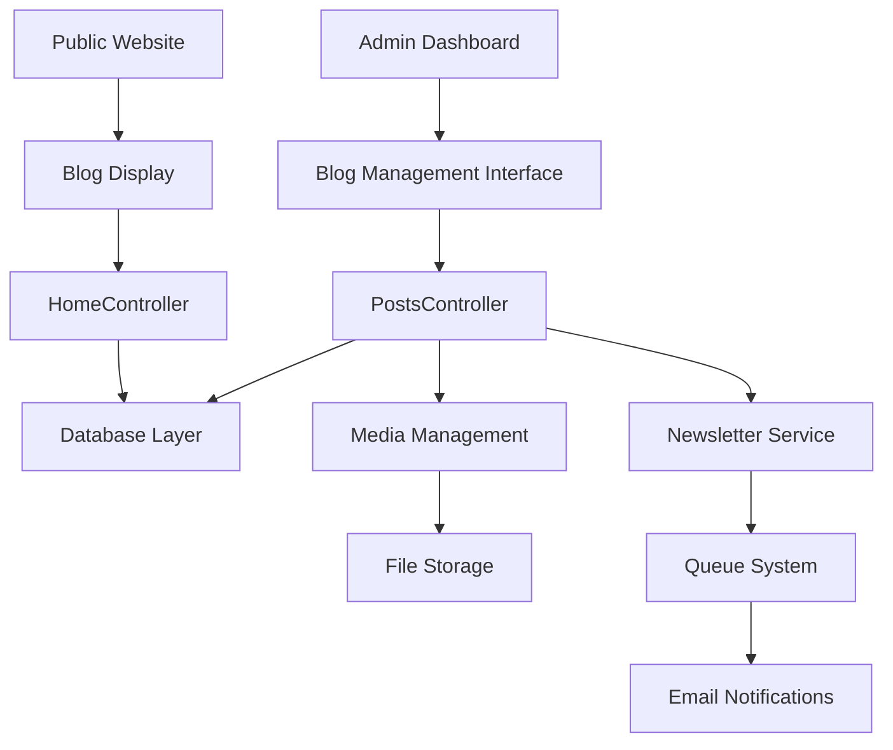

# Blog Management System Design

## Overview

The Blog Management System extends the existing Laravel/Vue.js application with comprehensive content creation and management capabilities. The system leverages the existing database structure (posts, post_categories, newsletter_subscribers tables) and integrates with the current admin dashboard architecture using Inertia.js for seamless SPA experience.

## Architecture

### High-Level Architecture



### Component Architecture

The system follows Laravel's MVC pattern with Vue.js components for the frontend:

- **Backend**: Laravel controllers, jobs, notifications, and database models
- **Frontend**: Vue.js components with Inertia.js for server-side rendering
- **Storage**: File system for media uploads with database metadata
- **Queue**: Background job processing for newsletter notifications

## Components and Interfaces

### 1. Admin Interface Components

#### BlogPostEditor Component
- **Purpose**: Rich text editor for blog content creation
- **Technology**: TipTap editor with Vue 3 integration
- **Features**: 
  - Rich text formatting (bold, italic, headers, lists)
  - Image and video embedding
  - Link insertion
  - Code blocks and quotes
  - Auto-save functionality

#### MediaLibrary Component
- **Purpose**: File upload and management interface
- **Features**:
  - Drag-and-drop file upload
  - Image preview and cropping
  - File organization and search
  - Bulk operations

#### PostManagement Component
- **Purpose**: Blog post listing and management
- **Features**:
  - Search and filtering
  - Status management
  - Bulk operations
  - Quick actions (publish, feature, delete)

### 2. Backend Controllers

#### PostsController (Enhanced)
```php
class PostsController extends Controller
{
    public function create(): Response
    public function store(Request $request): RedirectResponse
    public function edit(Post $post): Response
    public function update(Request $request, Post $post): RedirectResponse
    public function destroy(Post $post): RedirectResponse
    public function toggleFeatured(Post $post): RedirectResponse
}
```

#### MediaController
```php
class MediaController extends Controller
{
    public function upload(Request $request): JsonResponse
    public function index(): Response
    public function destroy(MediaFile $media): RedirectResponse
}
```

### 3. Public Interface Components

#### BlogList Component
- **Purpose**: Display blog posts on public pages
- **Features**:
  - Responsive grid layout
  - Category filtering
  - Pagination
  - Search functionality

#### BlogPost Component
- **Purpose**: Individual blog post display
- **Features**:
  - Rich content rendering
  - Social sharing
  - Related posts
  - Comments (if enabled)

## Data Models

### Existing Database Schema (Utilized)

#### Posts Table
- **Primary Key**: id
- **Content Fields**: title, slug, excerpt, content, featured_image
- **Metadata**: meta_data (JSON for SEO), gallery (JSON for additional images)
- **Status Management**: status, is_featured, published_at
- **Relationships**: category_id, author_id
- **Analytics**: views_count

#### Post Categories Table
- **Organization**: name, slug, description, color, sort_order
- **Status**: is_active

#### Newsletter Subscribers Table
- **Contact Info**: email, name
- **Preferences**: preferences (JSON), subscription_source
- **Status**: is_active, subscribed_at, unsubscribed_at
- **Security**: unsubscribe_token

### New Data Models

#### MediaFile Model
```php
class MediaFile extends Model
{
    protected $fillable = [
        'filename', 'original_name', 'mime_type', 'size',
        'path', 'alt_text', 'caption', 'folder_id'
    ];
}
```

## Error Handling

### Validation Rules

#### Blog Post Validation
- **Title**: Required, max 255 characters, unique slug generation
- **Content**: Required, minimum 50 characters
- **Category**: Required, must exist in post_categories
- **Featured Image**: Optional, valid image format, max 5MB
- **Status**: Must be one of: draft, published, scheduled
- **Published At**: Required if status is scheduled, must be future date

#### Media Upload Validation
- **File Types**: Images (jpg, png, gif, webp), Videos (mp4, webm)
- **File Size**: Images max 5MB, Videos max 50MB
- **Dimensions**: Images min 300x200px for featured images

### Error Response Handling

#### API Errors
```php
// Validation errors
return response()->json([
    'message' => 'Validation failed',
    'errors' => $validator->errors()
], 422);

// Server errors
return response()->json([
    'message' => 'Internal server error',
    'error' => $exception->getMessage()
], 500);
```

#### Frontend Error Display
- Form validation errors displayed inline
- Global error notifications for system errors
- Retry mechanisms for failed uploads
- Graceful degradation for offline scenarios

## Testing Strategy

### Unit Tests

#### Controller Tests
- **PostsController**: CRUD operations, validation, authorization
- **MediaController**: File upload, validation, storage
- **Newsletter**: Notification sending, queue processing

#### Model Tests
- **Post Model**: Relationships, scopes, mutators
- **MediaFile Model**: File handling, validation

### Integration Tests

#### Feature Tests
- **Blog Creation Workflow**: End-to-end post creation
- **Media Upload Process**: File upload and attachment
- **Newsletter Integration**: Notification sending on publish
- **Public Display**: Homepage and blog page rendering

#### API Tests
- **Media Upload Endpoints**: File handling, validation
- **Post Management APIs**: CRUD operations
- **Newsletter APIs**: Subscription management

### Frontend Tests

#### Component Tests
- **BlogPostEditor**: Content creation, media insertion
- **MediaLibrary**: File upload, selection
- **PostManagement**: Filtering, sorting, bulk operations

#### E2E Tests
- **Admin Workflow**: Complete blog post creation and publishing
- **Public Access**: Blog viewing and navigation
- **Newsletter Flow**: Subscription and notification receipt

## Performance Considerations

### Database Optimization
- **Indexes**: Existing indexes on status, published_at, category_id
- **Full-text Search**: Implemented for title, excerpt, content
- **Query Optimization**: Eager loading for relationships

### File Storage
- **Image Optimization**: Automatic resizing and compression
- **CDN Integration**: Ready for CDN deployment
- **Lazy Loading**: Images loaded on demand

### Caching Strategy
- **Page Caching**: Blog posts cached for 1 hour
- **Query Caching**: Category and author data cached
- **Media Caching**: File metadata cached

### Queue Management
- **Newsletter Jobs**: Background processing to avoid blocking
- **Retry Logic**: Failed jobs retry up to 3 times
- **Monitoring**: Queue status monitoring and alerts

## Security Considerations

### Authentication & Authorization
- **Admin Access**: Only authenticated admin users can manage posts
- **Role-based Permissions**: Future-ready for granular permissions
- **CSRF Protection**: All forms protected with CSRF tokens

### File Upload Security
- **File Type Validation**: Strict MIME type checking
- **File Size Limits**: Prevent resource exhaustion
- **Storage Isolation**: Uploaded files stored outside web root
- **Virus Scanning**: Ready for integration with scanning services

### Data Protection
- **Input Sanitization**: All user input sanitized
- **XSS Prevention**: Content properly escaped in views
- **SQL Injection**: Using Eloquent ORM and prepared statements
- **Newsletter Privacy**: Unsubscribe tokens for privacy protection