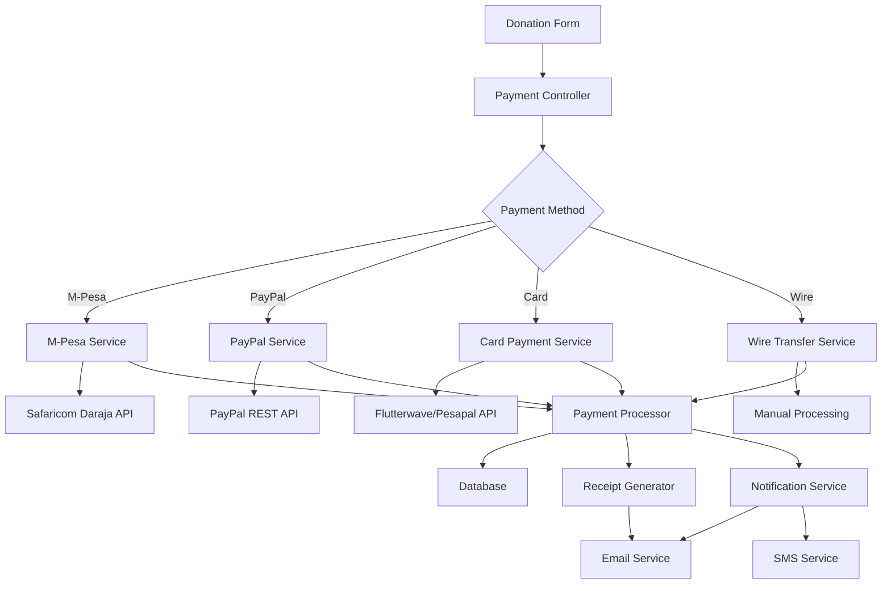

# Payment Integration Design Document

## Overview

This design document outlines the architecture and implementation approach for integrating multiple payment methods into the Ustawi Wa Jamii donation system. The solution will support local Kenyan payment methods (M-Pesa) and international options (PayPal, Visa/MasterCard, Wire Transfer) while maintaining security, reliability, and compliance standards.

## Architecture

### High-Level Architecture



### Payment Flow Architecture

1. **Payment Initiation**: User selects payment method and amount
2. **Payment Processing**: System routes to appropriate payment gateway
3. **Callback Handling**: System receives payment confirmation/failure
4. **Status Update**: Database updated with payment status
5. **Receipt Generation**: Digital receipt created and sent
6. **Notification**: User and admin notified of payment status

## Components and Interfaces

### 1. Payment Gateway Services

#### M-Pesa Service (`App\Services\Payments\MpesaService`)
```php
interface MpesaServiceInterface
{
    public function initiateSTKPush(array $paymentData): PaymentResponse;
    public function registerPaybillURL(): bool;
    public function processCallback(array $callbackData): PaymentResult;
    public function queryTransactionStatus(string $checkoutRequestId): TransactionStatus;
}
```

**Key Methods:**
- `initiateSTKPush()`: Triggers STK push to customer phone
- `registerPaybillURL()`: Registers callback URLs with Safaricom
- `processCallback()`: Handles M-Pesa payment callbacks
- `queryTransactionStatus()`: Checks payment status

#### PayPal Service (`App\Services\Payments\PaypalService`)
```php
interface PaypalServiceInterface
{
    public function createPayment(array $paymentData): PaymentResponse;
    public function executePayment(string $paymentId, string $payerId): PaymentResult;
    public function processWebhook(array $webhookData): PaymentResult;
    public function refundPayment(string $transactionId, float $amount): RefundResult;
}
```

#### Card Payment Service (`App\Services\Payments\CardPaymentService`)
```php
interface CardPaymentServiceInterface
{
    public function processPayment(array $cardData, array $paymentData): PaymentResponse;
    public function handle3DSecure(array $authData): PaymentResult;
    public function processWebhook(array $webhookData): PaymentResult;
    public function refundPayment(string $transactionId, float $amount): RefundResult;
}
```

### 2. Payment Processor Core

#### Main Payment Processor (`App\Services\PaymentProcessor`)
```php
class PaymentProcessor
{
    public function processPayment(PaymentRequest $request): PaymentResult;
    public function handleCallback(string $gateway, array $data): void;
    public function processRecurringPayment(Donation $donation): PaymentResult;
    public function refundPayment(Donation $donation, float $amount): RefundResult;
}
```

### 3. Data Models

#### Enhanced Donation Model
```php
// Additional fields for payment integration
protected $fillable = [
    // ... existing fields
    'payment_gateway', // mpesa, paypal, flutterwave, wire
    'gateway_payment_id', // Gateway-specific payment ID
    'gateway_response', // Full gateway response JSON
    'payment_intent_id', // For tracking payment intents
    'callback_received_at', // When callback was received
    'payment_confirmed_at', // When payment was confirmed
    'failure_reason', // Reason for payment failure
    'retry_count', // Number of retry attempts
    'next_retry_at', // When to retry failed payment
];
```

#### Payment Gateway Configuration Model
```php
class PaymentGatewayConfig extends Model
{
    protected $fillable = [
        'gateway_name',
        'is_active',
        'is_test_mode',
        'configuration', // JSON config for each gateway
        'supported_currencies',
        'supported_countries',
    ];
}
```

### 4. Configuration Management

#### Gateway Configuration Structure
```php
// M-Pesa Configuration
[
    'consumer_key' => env('MPESA_CONSUMER_KEY'),
    'consumer_secret' => env('MPESA_CONSUMER_SECRET'),
    'business_short_code' => env('MPESA_BUSINESS_SHORT_CODE'),
    'passkey' => env('MPESA_PASSKEY'),
    'callback_url' => env('MPESA_CALLBACK_URL'),
    'timeout_url' => env('MPESA_TIMEOUT_URL'),
    'result_url' => env('MPESA_RESULT_URL'),
    'environment' => env('MPESA_ENVIRONMENT', 'sandbox'),
]

// PayPal Configuration
[
    'client_id' => env('PAYPAL_CLIENT_ID'),
    'client_secret' => env('PAYPAL_CLIENT_SECRET'),
    'webhook_id' => env('PAYPAL_WEBHOOK_ID'),
    'environment' => env('PAYPAL_ENVIRONMENT', 'sandbox'),
]

// Flutterwave Configuration (for cards)
[
    'public_key' => env('FLUTTERWAVE_PUBLIC_KEY'),
    'secret_key' => env('FLUTTERWAVE_SECRET_KEY'),
    'encryption_key' => env('FLUTTERWAVE_ENCRYPTION_KEY'),
    'environment' => env('FLUTTERWAVE_ENVIRONMENT', 'staging'),
]
```

## Data Models

### Payment Transaction Schema
```sql
CREATE TABLE payment_transactions (
    id BIGINT PRIMARY KEY,
    donation_id BIGINT NOT NULL,
    gateway VARCHAR(50) NOT NULL,
    gateway_transaction_id VARCHAR(255),
    payment_intent_id VARCHAR(255),
    amount DECIMAL(15,2) NOT NULL,
    currency VARCHAR(3) NOT NULL,
    status ENUM('pending', 'processing', 'completed', 'failed', 'cancelled', 'refunded'),
    gateway_response JSON,
    callback_data JSON,
    processed_at TIMESTAMP NULL,
    failed_at TIMESTAMP NULL,
    failure_reason TEXT,
    retry_count INT DEFAULT 0,
    created_at TIMESTAMP,
    updated_at TIMESTAMP,
    
    INDEX idx_donation_gateway (donation_id, gateway),
    INDEX idx_gateway_transaction (gateway, gateway_transaction_id),
    INDEX idx_status_created (status, created_at)
);
```

### Payment Gateway Logs Schema
```sql
CREATE TABLE payment_gateway_logs (
    id BIGINT PRIMARY KEY,
    gateway VARCHAR(50) NOT NULL,
    transaction_id VARCHAR(255),
    request_type VARCHAR(50), -- 'payment', 'callback', 'webhook', 'refund'
    request_data JSON,
    response_data JSON,
    response_code VARCHAR(10),
    response_time_ms INT,
    ip_address VARCHAR(45),
    created_at TIMESTAMP,
    
    INDEX idx_gateway_transaction (gateway, transaction_id),
    INDEX idx_gateway_type (gateway, request_type),
    INDEX idx_created_at (created_at)
);
```

## Error Handling

### Payment Error Categories
1. **Gateway Errors**: API failures, network issues
2. **Validation Errors**: Invalid payment data
3. **Business Logic Errors**: Insufficient funds, duplicate payments
4. **System Errors**: Database failures, service unavailability

### Error Handling Strategy
```php
class PaymentErrorHandler
{
    public function handleGatewayError(GatewayException $e, PaymentRequest $request): PaymentResult;
    public function handleValidationError(ValidationException $e): PaymentResult;
    public function handleSystemError(SystemException $e, PaymentRequest $request): PaymentResult;
    public function shouldRetryPayment(PaymentException $e): bool;
    public function scheduleRetry(Donation $donation, int $retryCount): void;
}
```

### Retry Logic
- **M-Pesa**: Retry up to 3 times with exponential backoff
- **PayPal**: No automatic retry (user-initiated only)
- **Card Payments**: Retry once after 5 minutes for network errors
- **Wire Transfer**: Manual retry only

## Testing Strategy

### Unit Testing
- Test each payment service independently
- Mock external API calls
- Test error handling scenarios
- Validate data transformations

### Integration Testing
- Test complete payment flows
- Test callback handling
- Test webhook processing
- Test database transactions

### End-to-End Testing
- Test full user payment journey
- Test payment confirmation emails
- Test admin payment management
- Test recurring payment processing

### Security Testing
- Test payment data encryption
- Test callback URL security
- Test webhook signature validation
- Test SQL injection prevention

### Performance Testing
- Load test payment processing
- Test concurrent payment handling
- Test database performance under load
- Test external API response times

## Security Considerations

### Data Protection
- Encrypt sensitive payment data at rest
- Use HTTPS for all payment communications
- Implement PCI DSS compliance for card data
- Sanitize all callback data

### API Security
- Validate webhook signatures
- Implement rate limiting on payment endpoints
- Use secure callback URLs with tokens
- Log all payment-related activities

### Fraud Prevention
- Implement duplicate payment detection
- Monitor for suspicious payment patterns
- Set payment amount limits
- Implement IP-based restrictions for admin functions

### Access Control
- Role-based access to payment management
- Audit trail for all payment operations
- Secure storage of API credentials
- Regular rotation of API keys

## Deployment Considerations

### Environment Configuration
- Separate sandbox/production configurations
- Secure credential management
- Environment-specific callback URLs
- Database migration strategy

### Monitoring and Alerting
- Payment success/failure rate monitoring
- Gateway response time monitoring
- Failed payment alerting
- Revenue tracking and reporting

### Backup and Recovery
- Regular database backups
- Payment data retention policies
- Disaster recovery procedures
- Transaction reconciliation processes